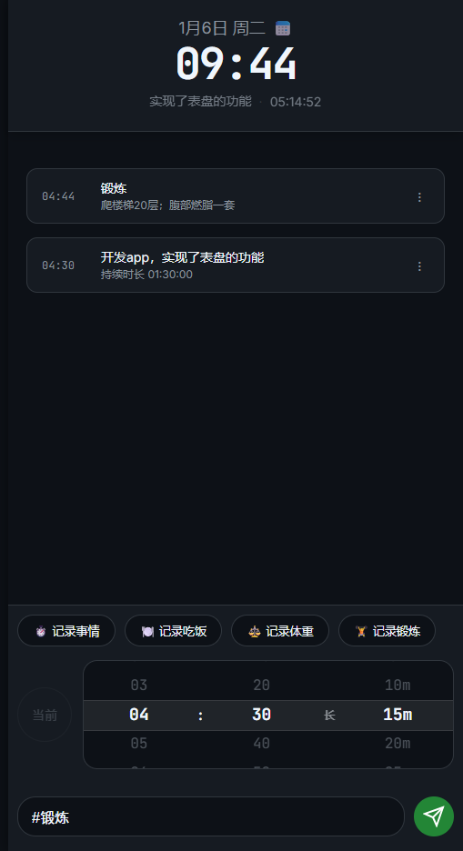

# LifeTimer - 极简生活时间记录工具

LifeTimer 是一款轻量级、响应式的个人时间管理工具，支持作为 **PWA (网页应用)** 或 **Android 原生 App** 运行。它旨在通过最简单的交互，帮助用户记录和回顾每天的时间流向。

## ✨ 主要功能

*   **垂直拨盘交互**：创新的垂直滑动滚轮，快速选择时间，操作感极佳。
*   **双模式记录**：
    *   **Now (实时模式)**：点击即刻切换当前活动，开始计时。
    *   **Manual (补录模式)**：拨动时间轮，补录过去的活动。
*   **支持时长记录**：除了记录切换点，还可以记录带有持续时间的“补充记录”。
*   **标签快捷输入**：支持通过 `#标签` 快速切换活动分类（运动、工作、睡眠等）。
*   **历史流展示**：清晰的时间轴展示，支持编辑已记录的条目名、时间及备注。
*   **本地存储 & 隐私控制**：数据完全存储在您的本地浏览器或 App 内部空间，**绝不上传云端**。
*   **数据导出**：支持一键导出 JSON 备份，确保数据掌控权。

## 📱 Android App 下载

为了方便安装，我们已经在 GitHub 上发布了正式版本（Release）。

1.  访问仓库右侧的 **[Releases](https://github.com/clipdalle/life_timer/releases)** 页面。
2.  找到最新的版本（例如 `v0.0.1`）。
3.  在 **Assets** 区域点击下载 `LifeTimer-v0.0.1.apk`。
4.  将文件传到手机点击安装。

*注意：安装时手机可能会提示“来源未知”，请选择“仍要安装”即可。*

## 🌐 网页版运行

如果您想在浏览器中使用或进行二次开发：

1.  克隆仓库：`git clone ...`
2.  进入目录，运行本地服务器：`python -m http.server 8080` (或使用 VS Code Live Server)
3.  浏览器访问：`http://localhost:8080`

## 🛠️ 技术栈

*   **核心**: 原生 HTML5 / CSS3 / Vanilla JavaScript (ES6+)
*   **App 容器**: [Capacitor](https://capacitorjs.com/)
*   **CI/CD**: GitHub Actions
*   **PWA**: Service Worker / Manifest.json
